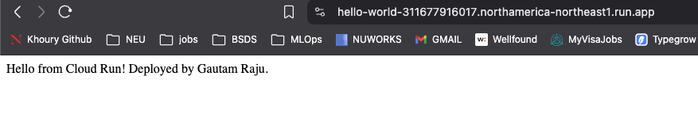
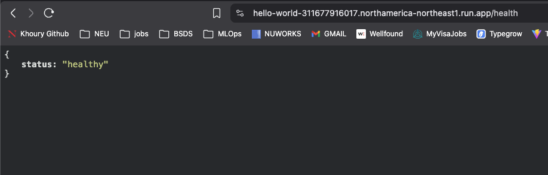
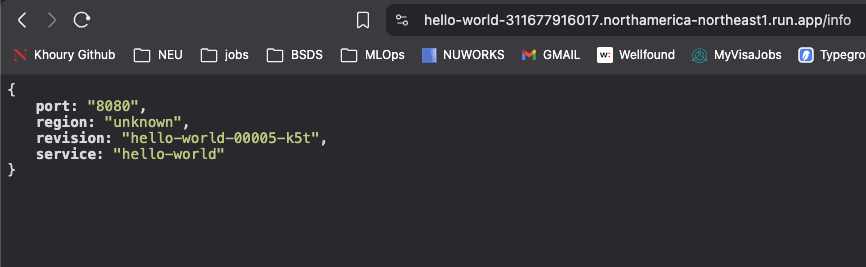

# Cloud Run Lab

A containerized Flask application deployed on Google Cloud Run.

## What it does

| Endpoint | Description |
|----------|-------------|
| `/` | Returns a hello message |
| `/health` | Health check — returns `{"status": "healthy"}` |
| `/info` | Returns Cloud Run metadata (service name, revision, region) |

## Screenshots

**`/` — Home**


**`/health` — Health check**


**`/info` — Service info**


## Stack

- Python / Flask + Gunicorn
- Docker (linux/amd64)
- Google Artifact Registry
- Google Cloud Run

## Deploy

**Build and push image:**
```bash
docker build --platform linux/amd64 -t northamerica-northeast1-docker.pkg.dev/PROJECT_ID/REPO/IMAGE:TAG .
docker push northamerica-northeast1-docker.pkg.dev/PROJECT_ID/REPO/IMAGE:TAG
```

**Deploy to Cloud Run:**
```bash
gcloud run deploy SERVICE_NAME \
  --image northamerica-northeast1-docker.pkg.dev/PROJECT_ID/REPO/IMAGE:TAG \
  --region northamerica-northeast1 \
  --allow-unauthenticated
```

## Modifications from base lab

- Replaced `gcr.io` (deprecated) with Google Artifact Registry
- Added `/health` and `/info` endpoints
- Switched from Flask dev server to Gunicorn for production readiness
- Image built with `--platform linux/amd64` for Cloud Run compatibility
